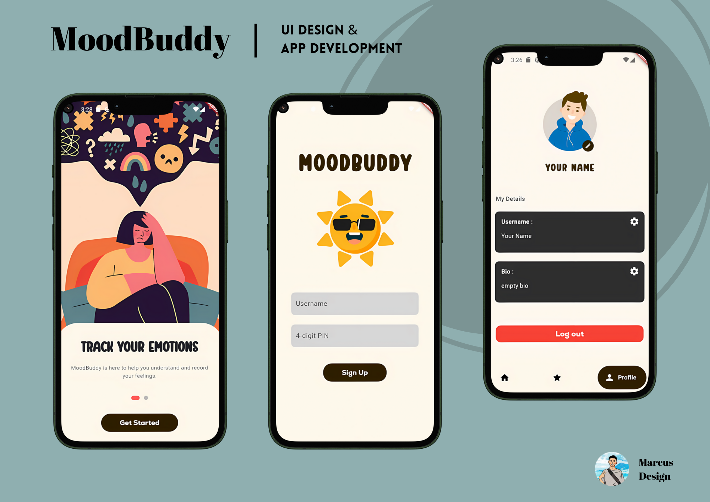
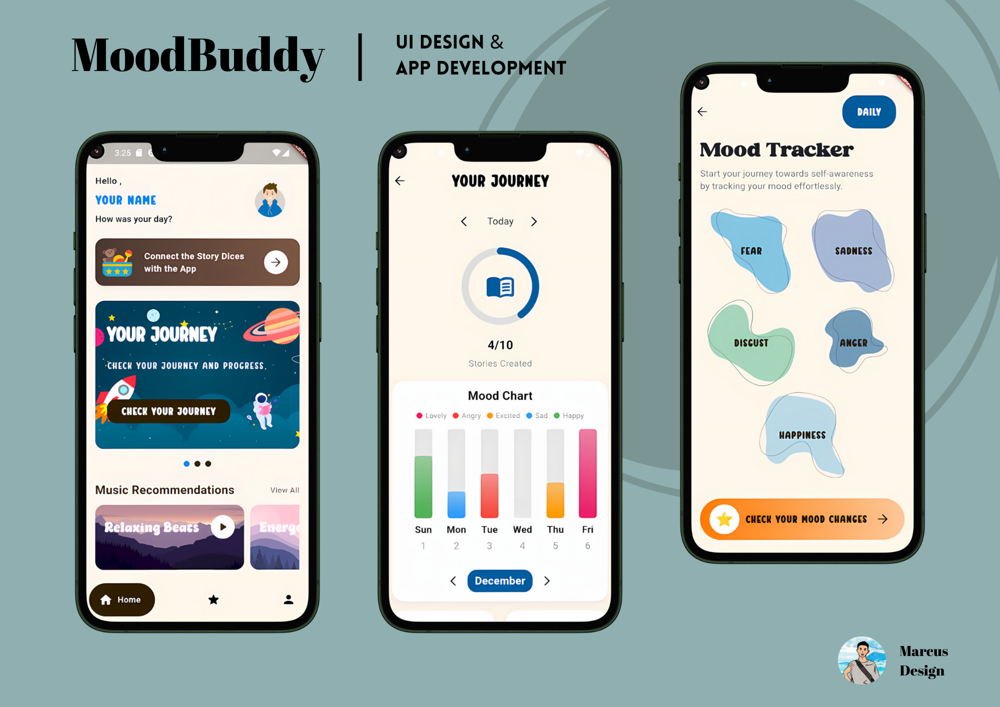

# Moodbuddy Mobile Application

The Interactive Story Dice and MoodBuddy App is a mobile application designed to help autistic children express their emotions and build creativity through storytelling. The app integrates with a set of physical story dice (Toys) that children can use to create unique narratives, which are then tracked and analyzed within the app.

## Table of Contents

- [Showcase](#showcase)
- [Features](#features)
- [Technology Stack](#technology-stack)
- [Installation](#installation)
- [License](#license)

## Showcase

 


## Features

- **Emotion Dice:** Dice with symbols representing different emotions (e.g., happy, sad, angry, calm) to facilitate emotional expression.

- **Character, Setting, and Action Dice:** Dice with images of relatable characters, settings, and actions to encourage creative storytelling.

- **Storytelling Integration:** The app automatically captures the outcomes of the dice rolls and allows the child or parent to input the story.

- **Mood Tracking:** Children can log their mood before and after the storytelling session, which is tracked within the app.

- **Progress Monitoring:** The app provides insights into the child's emotional trends, mood changes, and storytelling progression.

- **Reward System:** Children earn stars or badges for completing stories, using diverse dice, and showing mood improvements.

- **Personalized Recommendations:** The app suggests calming activities or music based on the child's emotional patterns.

## Technology Stack

- Framework: Flutter (cross-platform mobile development)
- Programming Language: Dart


## Installation

1. Clone the repository:

```bash
git clone https://github.com/MarcusMQF/MoodBuddy-MobileApp.git
```

2. Install the required dependencies:

```bash
cd MoodBuddy-MobileApp
flutter pub get
```
3. Connect your mobile device or start an emulator.

4. Run the app:

```bash
flutter run
```

## License

This project is licensed under the [MIT License](LICENSE).